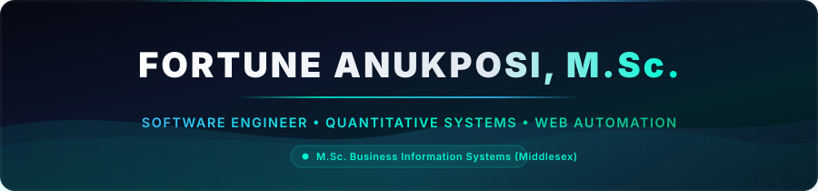
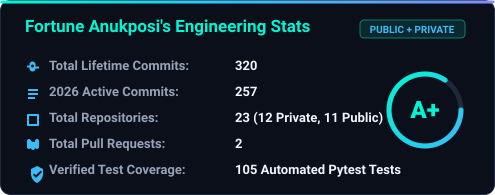
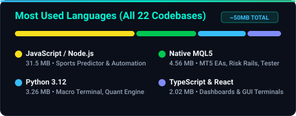

<!-- HERO BANNER (Native SVG - 100% reliable, zero downtime) -->

  

<!-- ANIMATED TYPING SUBHEADER -->

  

<!-- RECRUITER & EMPLOYER QUICK PINS -->

  
  &nbsp;
  
  &nbsp;
  
  &nbsp;
  

---

### 👨‍💻 Professional Summary & Value Proposition

I am a **Software Engineer and Quantitative Systems Developer** with a formal academic foundation in enterprise information systems and hands-on experience building complex, production-oriented software. 

Holding both a **Master of Science (M.Sc.) with Merit** and a **Bachelor of Science (B.Sc. Hons)** in Information Technology and Business Information Systems from **Middlesex University**, together with an **Advanced Diploma in Software Engineering**, I combine deep theoretical systems knowledge with rigorous execution:

- 🏗️ **End-to-End System Development**: Proven ability to architect, build, test, and ship complete software ecosystems solo—from high-throughput scraping pipelines and database storage to containerized FastAPI/React applications and native MetaTrader 5 trading engines.
- 📐 **Data-Driven & Quantitative Focus**: Experienced in implementing mathematical and statistical models, including **Poisson distributions** for sports prediction, **macro factor decomposition** with Z-score standardization, and **risk-managed algorithmic trading robots**.
- 🛡️ **Defensive & Reliable Engineering**: Prioritizing error resilience, connection health checks, exponential backoff retries, and automated test suites (`pytest`) to build software that runs stably in production environments.
- ⚡ **AI-Augmented Velocity**: Expert at leveraging modern AI pair-programming and code-generation tools to accelerate prototyping, explore architectural patterns, and deliver robust software with high efficiency.

---

### 💼 What I Bring to Your Engineering Team

| Core Capability | Production Implementation Details |
| :--- | :--- |
| **Backend & API Design** | Clean, modular microservices in **FastAPI** and **Node.js** with typed schemas (**Pydantic**), REST endpoints, and WebSockets. |
| **Relational Database Systems** | High-speed data caching and storage with **SQLite** (WAL mode) and **PostgreSQL**, managing datasets exceeding 390MB+ and hundreds of thousands of records. |
| **Automated Testing & QA** | Writing comprehensive automated test suites (**Pytest**) with strict zero-lookahead bias audits and regression testing. |
| **Browser Automation & Test Engineering** | Low-latency **Puppeteer** & **CDP** test/execution engines with Bézier trajectory input kinetics, session self-healing, and real-time Electron telemetry. |
| **Algorithmic Trading & FinTech** | Developing native **MQL5 for MetaTrader 5** with centralized risk governance, automated broker timezone synchronization, and hard drawdown circuit breakers. |
| **DevOps & Infrastructure** | Containerization with **Docker** and **Docker Compose**, headless Linux server deployment, Git version control, and CI/CD pipelines. |

---

### 📊 Real-Time GitHub Engineering Pulse

  

    
  

  <table border="0">
    <tr>
      <td width="50%" align="center">
        
      </td>
      <td width="50%" align="center">
        
      </td>
    </tr>
    <tr>
      <td colspan="2" align="center">
        
      </td>
    </tr>
  </table>

---

### 🚀 Key Engineering Projects & Codebases

<table>
  <!-- ROW 1: MACRO TERMINAL & FOOTBALL PREDICTOR -->
  <tr>
    <td width="50%" valign="top">
      <h3 align="left">🌐 Quantitative Macro Fundamental Intelligence Engine</h3>
      
<b>Automated Macro-Fundamental Intelligence & Market-Bias Platform across 50 Global Assets</b>

      

        
        
        
        
      

      <ul>
        <li><b>Engineering Problem:</b> Manual macroeconomic analysis is slow, inconsistent, and prone to hindsight bias. This platform systematically evaluates incoming economic prints against expectations.</li>
        <li><b>Technical Highlights:</b>
          <ul>
            <li>14-dimension macro factor decomposition (monetary policy, inflation, real yields, terms-of-trade) producing a normalized -100 to +100 directional bias scale.</li>
            <li>Built with <b>FastAPI</b>, <b>React 18</b>, <b>TypeScript</b>, and <b>TailwindCSS</b>, fully containerized via <b>Docker Compose</b>.</li>
            <li>Rigorous test coverage: <b>105 automated unit tests passing</b> validating zero-lookahead bias and factor decay calculations.</li>
          </ul>
        </li>
      </ul>
    </td>
    <td width="50%" valign="top">
      <h3 align="left">⚽ Event-Driven Football Simulation &amp; Statistical Prediction Engine</h3>
      
<b>Quantitative Probability Modeling Platform, Backtest Harness &amp; Desktop Operator Dashboard</b>

      

        
        
        
        
      

      <ul>
        <li><b>Engineering Problem:</b> Forecasting event-driven sports probabilities and capturing market value discrepancies requires high-throughput time-series ingestion, dynamic form decay, and multi-market probability matrices.</li>
        <li><b>Technical Highlights:</b>
          <ul>
            <li><b>Mathematical &amp; ML Core (<code>analytics/</code> &amp; <code>models/</code>):</b> Computes dynamic attack/defense coefficients via <b>Poisson probability mass functions</b> and exponential time-decay kernels. Features pre-trained ML calibration models for Over/Under (1.5, 2.5, 3.5), Both Teams to Score (BTTS), and HT/FT Markovian transition matrices.</li>
            <li><b>Real-Time Desktop Dashboard (<code>dashboard/</code>):</b> Cross-platform operator control center engineered with <b>Electron 29</b>, <b>React 18</b>, <b>Vite</b>, and <b>TailwindCSS</b>, featuring live match countdowns, form streaks, and bankroll equity curve simulation.</li>
            <li><b>Time-Series Storage &amp; Ingestion:</b> High-concurrency <b>SQLite storage running in WAL mode</b> with sub-millisecond query indexing and a modular WebSocket streaming ingestion adapter.</li>
          </ul>
        </li>
      </ul>
    </td>
  </tr>

  <!-- ROW 2: PROPER EA & PUPPETEER -->
  <tr>
    <td width="50%" valign="top">
      <h3 align="left">📈 Proper-EA-Dream: Multi-Market Quantitative Risk Suite</h3>
      
<b>Algorithmic Trading & Risk Governance System for MetaTrader 5 (MQL5)</b>

      

        
        
        
        
      

      <ul>
        <li><b>Engineering Problem:</b> Managing concurrent algorithmic positions across volatile asset classes requires centralized, thread-safe risk rails to prevent capital breach.</li>
        <li><b>Technical Highlights:</b>
          <ul>
            <li>Simultaneous execution across <code>XAUUSD (Gold)</code>, <code>NAS100</code>, <code>USA500</code>, and <code>GBPUSD</code> within a unified process.</li>
            <li>Real-time automated broker timezone and Daylight Saving Time (DST) synchronization to gate high-spread rollover windows (21:55–22:15 UTC).</li>
            <li>Hard daily circuit breakers and maximum drawdown cutoffs enforcing strict capital preservation.</li>
          </ul>
        </li>
      </ul>
    </td>
    <td width="50%" valign="top">
      <h3 align="left">🤖 Nexus VFL: Automated Browser Execution Engine &amp; Control Dashboard</h3>
      
<b>Deterministic Browser Test/Execution Pipeline &amp; Real-Time Telemetry Management Console</b>

      

        
        
        
        
      

      <ul>
        <li><b>Engineering Problem:</b> High-throughput virtual sports execution requires deterministic DOM interaction, zero-flakiness event dispatching, and real-time risk controls without human intervention.</li>
        <li><b>Technical Highlights:</b>
          <ul>
            <li><b>Deterministic CDP Dispatching:</b> Employs low-level <b>Chrome DevTools Protocol (CDP)</b> event synthesis (<code>Input.dispatchMouseEvent</code>, <code>Input.dispatchKeyEvent</code>) with cubic Bézier trajectory physics and micro-jitter delays to ensure authentic, non-synthetic UI validation.</li>
            <li><b>Session Self-Healing &amp; Resilience:</b> Autonomous recovery mechanisms that detect and repair corrupt browser preferences, handle modal dismissals, and retry dropped WebSocket telemetry streams.</li>
            <li><b>Nexus Desktop Control Center (<code>dashboard/</code>):</b> Full-stack desktop dashboard built with <b>Electron 29</b>, <b>React 18</b>, and <b>TailwindCSS</b> providing live match telemetry, capital preservation guards (Stop-Loss/Take-Profit), and VPS process management.</li>
          </ul>
        </li>
      </ul>
    </td>
  </tr>

  <!-- ROW 3: TRIPLE EA & FORTUNE4X TESTER PRO -->
  <tr>
    <td width="50%" valign="top">
      <h3 align="left">⚡ Triple-EA Multi-Strategy Portfolio Engine</h3>
      
<b>Multi-Strategy Quantitative Execution Suite with Centralized Risk Governor</b>

      

        
        
        
      

      <ul>
        <li><b>Architecture:</b> Coordinates three orthogonal strategies (US500 Donchian breakout, Opening Wick Arbitrage, and USDJPY FX momentum) governed by a central thread-safe risk manager (`PortfolioRiskManager.mqh`).</li>
        <li><b>Execution Resilience:</b> Automatic order filling fallback logic (<code>FOK &rarr; IOC &rarr; RETURN</code>) with exponential backoff retries and 1.5% max concurrent portfolio risk ceiling.</li>
      </ul>
    </td>
    <td width="50%" valign="top">
      <h3 align="left">🧪 Fortune4X Tester Pro: Market Replay Simulator &amp; Execution Engine</h3>
      
<b>High-Performance Manual Backtesting &amp; Visual Replay Platform for MetaTrader 5 (MT5)</b>

      

        
        
        
        
      

      <ul>
        <li><b>Interactive Execution Ladder:</b> Visual on-chart order handles with independent drag handles (Cyan Entry line, Crimson Stop Loss with dynamic dollar risk, Emerald Take Profit with real-time Risk-to-Reward ratio).</li>
        <li><b>Precision Market Replay:</b> Bar-by-bar candle stepping, collision-free hotkeys, and variable playback speeds for discretionary and systematic setup validation.</li>
        <li><b>Smart Money Concepts (SMC):</b> Integrated algorithmic detection for Order Blocks (OB), Fair Value Gaps (FVG), Market Structure Breaks (BOS/CHoCH), and Liquidity Sweeps.</li>
      </ul>
    </td>
  </tr>
</table>

---

### 🛠️ Technical Skills & Tooling Matrix

<table width="100%">
  <tr>
    <th align="left" width="28%">Domain</th>
    <th align="left" width="72%">Technologies, Frameworks & Standards</th>
  </tr>
  <tr>
    <td><b>Languages</b></td>
    <td>
      
      
      
      
      
      
    </td>
  </tr>
  <tr>
    <td><b>Backend & APIs</b></td>
    <td>
      
      
      
      
      
    </td>
  </tr>
  <tr>
    <td><b>Databases & Caching</b></td>
    <td>
      
      
      
      
    </td>
  </tr>
  <tr>
    <td><b>Frontend & Desktop UI</b></td>
    <td>
      
      
      
      
      
    </td>
  </tr>
  <tr>
    <td><b>Quantitative & Modeling</b></td>
    <td>
      
      
      
      
      
    </td>
  </tr>
  <tr>
    <td><b>DevOps, QA & Tools</b></td>
    <td>
      
      
      
      
      
    </td>
  </tr>
</table>

---

### 🎓 Academic Credentials & Education

<table width="100%">
  <tr>
    <th align="left" width="20%">Year</th>
    <th align="left" width="50%">Degree / Qualification</th>
    <th align="left" width="30%">Institution</th>
  </tr>
  <tr>
    <td><b>2018 – 2019</b></td>
    <td><b>Master of Science (M.Sc.) with Merit</b> <i>Business Information Systems Management</i></td>
    <td><b>Middlesex University</b></td>
  </tr>
  <tr>
    <td><b>2016 – 2018</b></td>
    <td><b>Bachelor of Science (B.Sc. Hons) with Upper Second-Class Honors</b> <i>Information Technology and Business Information Systems</i></td>
    <td><b>Middlesex University</b></td>
  </tr>
  <tr>
    <td><b>2014 – 2016</b></td>
    <td><b>Advanced Diploma in Software Engineering</b> <i>Software Engineering Curriculum</i></td>
    <td><b>Aptech Computer Education</b></td>
  </tr>
  <tr>
    <td><b>2019 – 2020</b></td>
    <td><b>National Youth Service Corps (NYSC)</b></td>
    <td><b>Standards Organisation of Nigeria</b></td>
  </tr>
</table>

---

### 📬 Work Availability & Contact

I am actively open to:
- 💼 **Full-Time Software Engineer Roles** (Python, Backend, Full-Stack, Automation)
- 📈 **Quantitative Developer / FinTech Roles** (Algorithmic Trading, Strategy Implementation, Risk Systems)
- 🌍 **Work Mode**: Open to **Remote Roles Globally**, Hybrid, or Relocation.

&nbsp;&nbsp;

&nbsp;&nbsp;

  

<i>"I believe great software engineering is built on curiosity, deep domain understanding, disciplined testing, and an unrelenting drive to deliver real-world value."</i>

  

<!-- FOOTER BANNER (Native SVG) -->

